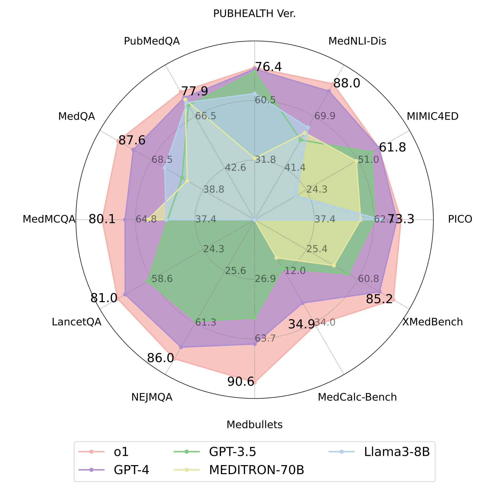
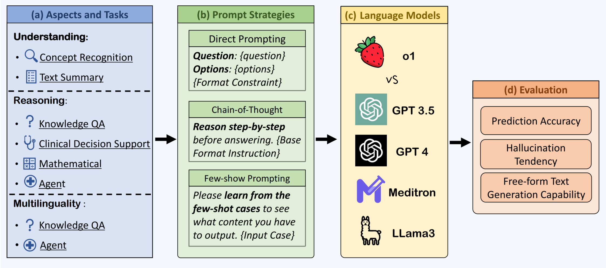
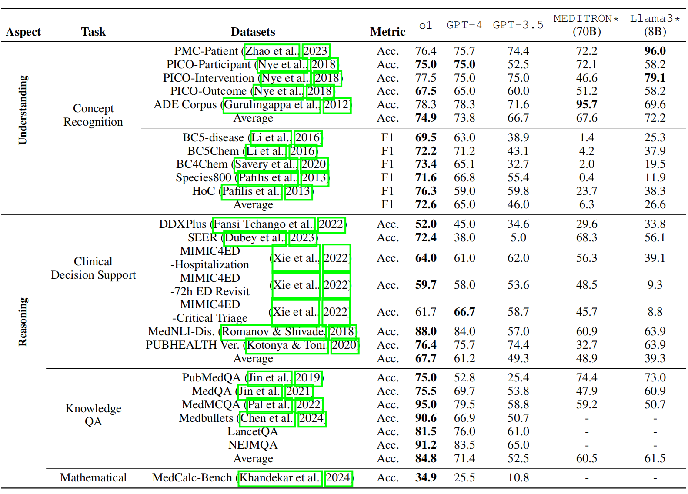
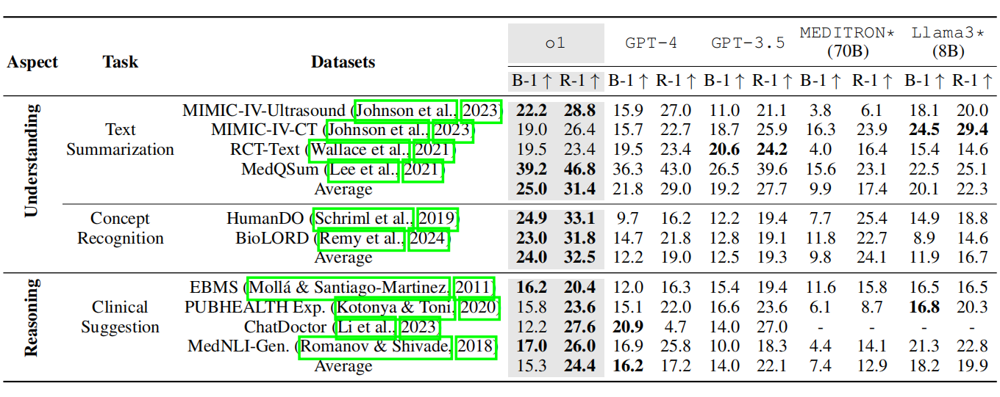
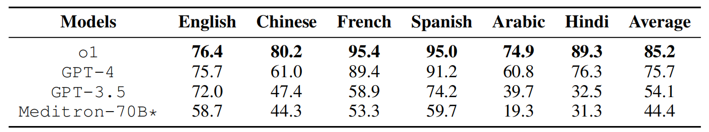
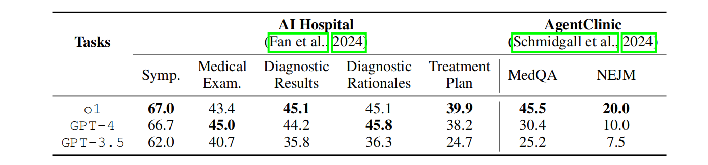
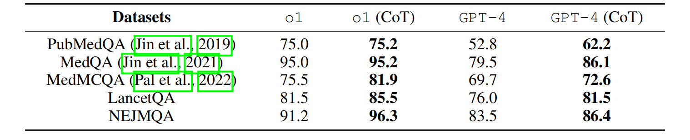
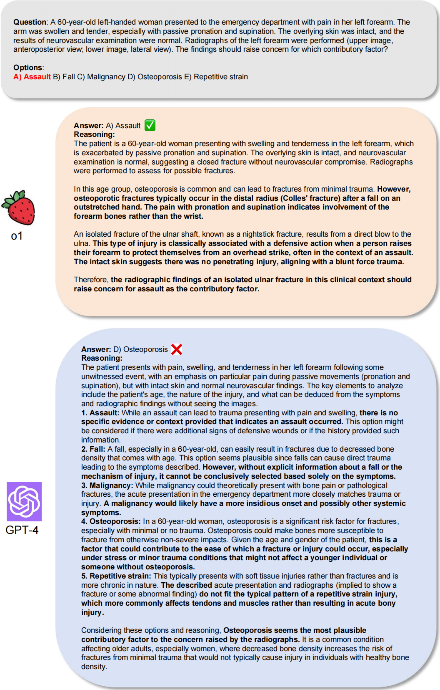
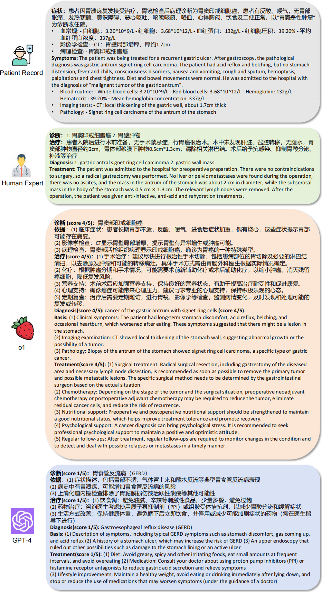
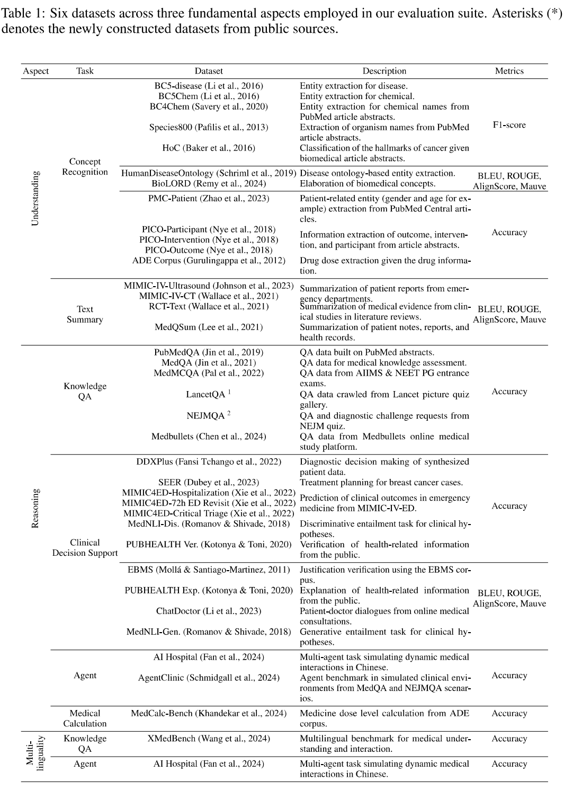

# <div align="center">A Preliminary Study of o1 in Medicine: Are We Closer to an AI Doctor?</div>

<div align="center">
  <a href="https://github.com/UCSC-VLAA/o1_medicine"></a>  
  <a href="https://ucsc-vlaa.github.io/o1_medicine/"></a>  
  <a href="http://arxiv.org/abs/2409.15277"></a>  
  <a href="https://huggingface.co/datasets/UCSC-VLAA/o1_medical"></a>  
</div>


---

> **A Preliminary Study of o1 in Medicine: Are We Closer to an AI Doctor?** 

 [Yunfei Xie*](https://yunfeixie233.github.io/), [Juncheng Wu*](https://chtholly17.github.io/), [Haoqin Tu*](https://www.haqtu.me/), [Siwei Yang*](https://laos-y.github.io/#about), [Bingchen Zhao](https://bzhao.me/), [Yongshuo Zong](https://ys-zong.github.io/), [Qiao Jin](https://andy-jqa.github.io/), [Cihang Xie](https://cihangxie.github.io/), [Yuyin Zhou](https://yuyinzhou.github.io/)

<sup>*</sup> Equal technical contribution  
<sup>1</sup> UC Santa Cruz, <sup>2</sup> University of Edinburgh, <sup>3</sup> National Institutes of Health

---

## 📢 Breaking News

- **[📄💥 September 24, 2024] [Our arXiv paper is released](http://arxiv.org/abs/2409.15277).**


### Performances Overview
<div style="width: 100%; margin: 0 auto;">
  <p align="center">
    
  </p>
  <p align="left"><strong>Figure 1:</strong> Overall results of o1 and other 4 strong LLMs. We show performance on 12 medical datasets spanning diverse domains. o1 demonstrates a clear performance advantage over closed- and open-source models.</p>
</div>

<div style="width: 100%; margin: 0 auto;">
  <p align="center">
    
  </p>
  <p align="left"><strong>Figure 2:</strong> Average accuracy of o1 and other 4 strong LLMs. o1 achieves the highest average accuracy of 73.3% across 19 medical datasets.</p>
</div>

---

## 🏥 Our Pipeline

<p align="center">
  
</p>

<p align="left"><strong>Figure 3:</strong> Our evaluation pipeline comprises different evaluation (a) <em>aspects</em> containing various <em>tasks</em>. We collect multiple (b) <em>datasets</em> for each task, combining them with various (c) <em>prompt strategies</em> to evaluate the latest (d) <em>language models</em>. We leverage a comprehensive set of (e) <em>evaluations</em> to present a holistic view of model progress in the medical domain.</p>

---

## 🚀 Performances of o1

<p align="center">
  
</p>

<p align="left"><strong>Table 1:</strong> Accuracy (Acc.) or F1 results on 4 tasks across 2 aspects. Model performances with * are taken from <cite>Wu et al. (2024)</cite> as the reference. We also present the average score (Average) of each metric in the table.</p>


<p align="center">
  
</p>

<p align="left"><strong>Table 2:</strong> BLEU-1 (B-1) and ROUGE-1 (R-1) results on 3 tasks across 2 aspects. We use the gray background to highlight o1 results. We also present the average score (Average) of each metric.</p>

<p align="center">
  
</p>

<p align="left"><strong>Table 3:</strong> Accuracy of models on the multilingual task, XMedBench <cite>Wang et al. (2024)</cite>.</p>

<p align="center">
  
</p>

<p align="left"><strong>Table 4:</strong> Accuracy of LLMs on two agentic benchmarks.</p>

<p align="center">
  
</p>

<p align="left"><strong>Table 5:</strong> Accuracy results of model outputs with/without CoT prompting on 5 knowledge QA datasets.</p>

---

## 🔍 Case Study

<p align="center">
  
</p>

<p align="left"><strong>Figure 4:</strong> Comparison of the answers from o1 and GPT-4 for a question from NEJM. o1 provides a more concise and accurate reasoning process compared to GPT-4.</p>

<p align="center">
  
</p>

<p align="left"><strong>Figure 5:</strong> Comparison of the answers from o1 and GPT-4 for a case from the Chinese dataset AI Hospital, along with its English translation. o1 offers a more precise diagnosis and practical treatment suggestions compared to GPT-4.</p>

---

## 🛠️ Setup

### Setting Up Evals

To set up the evaluation framework, clone our repository and run the setup script:

```bash
git clone https://github.com/UCSC-VLAA/o1_eval.git
cd o1_eval
bash setup.sh
```

### Configuring OpenAI API

Create a `.env` file in the root directory and add your OpenAI API credentials:

```bash
OPENAI_ORGANIZATION_ID=...
OPENAI_API_KEY=...
```

## 📊 Evaluation on Existing Data

### Overview of Datasets

We include the prompts and inquiries used in our paper. The detailed datasets are listed below, except for LancetQA and NEJMQA due to copyright.


<p align="center">
  
</p>

### Running Evaluations on No-Agent Tasks

In the `eval_bash` directory, there are evaluation scripts corresponding to each dataset. Simply run the scripts to perform the evaluations.

```bash
bash eval_bash/eval_dataset_name/eval_script.sh
```


### Running Evaluations on Agent Tasks

#### AgentClinic

1. Clone the AgentClinic repository:
   ```bash
   git clone https://github.com/SamuelSchmidgall/AgentClinic/
   ```
   Follow the installation instructions provided in the repository's `README.md`.

2. To run evaluations, execute the following bash command with the specified parameters:
   ```bash
   python agentclinic.py --doctor_llm o1-preview \
        --patient_llm o1-preview --inf_type llm \
        --agent_dataset dataset --doctor_image_request False \
        --num_scenarios 220 \
        --total_inferences 20 --openai_client
   ```
   - `--agent_dataset`: You can choose between `MedQA` or `NEJM_Ext`.

#### AI Hospital

1. Clone the AI Hospital repository:
   ```bash
   git clone https://github.com/LibertFan/AI_Hospital
   ```
   Follow the installation instructions provided in the repository's `README.md`.

2. To run evaluations, execute the following bash command with the specified parameters:
   ```bash
   python run.py --patient_database ./data/patients_sample_200.json \
    --doctor_openai_api_key $OPENAI_API_KEY \
    --doctor Agent.Doctor.GPT --doctor_openai_model_name o1-preview \
    --patient Agent.Patient.GPT --patient_openai_model_name gpt-3 \
    --reporter Agent.Reporter.GPT --reporter_openai_model_name gpt-3 \
    --save_path outputs/dialog_history_iiyi/dialog_history_gpto1_200.jsonl \
    --max_conversation_turn 10 --max_workers 2 --parallel
   ```
   - Note: We evaluated only the first 200 records from AI Hospital due to cost constraints.


## 📈 Evaluation on New Data

Our evaluation framework is fully based on [OpenAI Evals](https://github.com/openai/evals). OpenAI Evals provides a framework for evaluating large language models (LLMs) or systems built using LLMs. It offers an existing registry of evaluations to test different dimensions of OpenAI models and the ability to write your own custom evaluations for use cases you care about. You can also use your data to build private evaluations representing the common LLM patterns in your workflow without exposing any of that data publicly.

For detailed instructions on creating and running custom evaluations, please refer to the [OpenAI Evals documentation](https://github.com/openai/evals).

---

## 🙏 Acknowledgement

This work is partially supported by the OpenAI Researcher Access Program and Microsoft Accelerate Foundation Models Research Program. [Q.J.](https://andy-jqa.github.io/) is supported by the NIH Intramural Research Program, National Library of Medicine. The content is solely the responsibility of the authors and does not necessarily represent the official views of the funding agencies.

---

## 📜 Citation

If you find this work useful for your research and applications, please cite using this BibTeX:

```bibtex
@misc{xie2024preliminarystudyo1medicine,
      title={A Preliminary Study of o1 in Medicine: Are We Closer to an AI Doctor?}, 
      author={Yunfei Xie and Juncheng Wu and Haoqin Tu and Siwei Yang and Bingchen Zhao and Yongshuo Zong and Qiao Jin and Cihang Xie and Yuyin Zhou},
      year={2024},
      eprint={2409.15277},
      archivePrefix={arXiv},
      primaryClass={cs.CL},
      url={https://arxiv.org/abs/2409.15277}, 
}
```


## 🔗 Related Projects

- [MedS-Bench](https://github.com/MAGIC-AI4Med/MedS-Ins)

---
